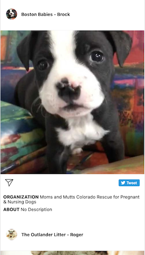
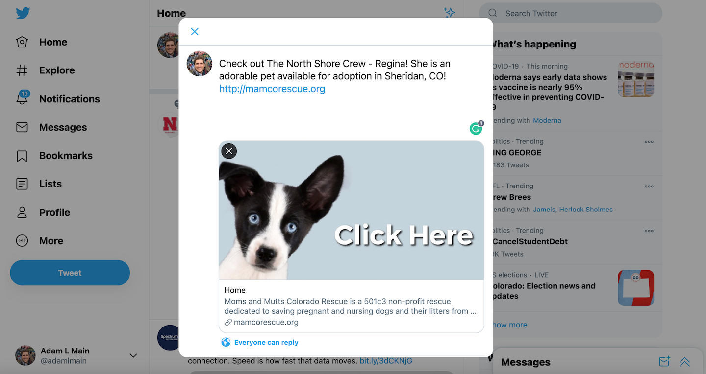

<!-- # https://adammain.github.io/perfect-pet/

Initial wireframes:

https://gist.github.com/adammain/7bad1a81462955743a3fc5ae99b01290 -->
# [Perfect Pet](https://adammain.github.io/perfect-pet/)

Search and find pets (dogs or cats) available for adoption from highly reputable adoption agencies near given zipcodes.  

## Motivation

As a animal lover, I wanted an easy way to search dogs available for adoption in my city without having to research all the adoption agencies in my area.  With this app, you can search almost trustworthy adoption agencies without having to visit their sites invidually. 

## Build Status

## Screenshots
Landing Page Desktop/Mobile:

Filtered Results Desktop/Mobile:

Pet Detail:

Share on Twitter:

Share with Email:

## Built With

### Front-End
* HTML/CSS
* JavaScript
* Jquery

## Features

* Search for adoptable pets near given zipcode
* Filter results by dog or cat (additional filtrs in progress)
* View individual pet and adoption agency details
* Share favorite pets on twitter or with email
* Fully responsive for mobile screens

## Demo

- [Live Demo](https://adammain.github.io/perfect-pet/)

## Authors

* **Adam Main**